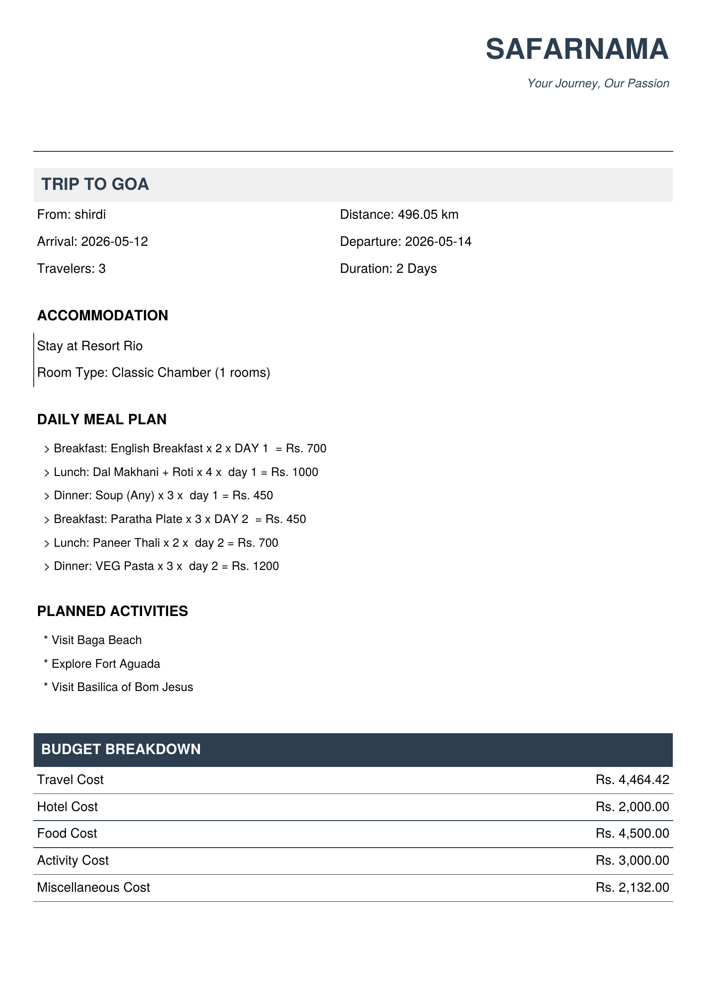
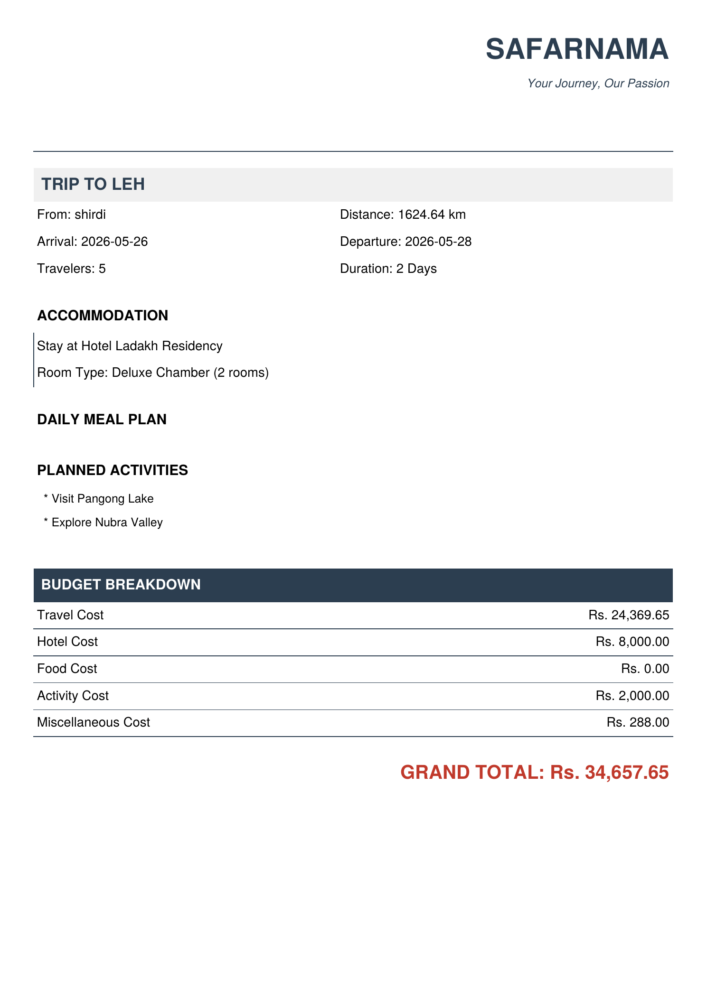

# 🧳 Safarnama — Travel Itinerary Planner

> *Your Journey, Our Passion*

Safarnama is a Python-based command-line travel itinerary planner built for Indian destinations. It helps users plan end-to-end trips — from selecting a destination and travel mode to booking hotels, planning meals, choosing activities, and generating a polished PDF itinerary — all from the terminal.

---

## 📸 Sample Output — Generated PDF Itineraries

### 🏖️ Trip to Goa


### 🏔️ Trip to Leh


> PDF files are automatically saved in the project directory as `<DESTINATION>_Itinerary.pdf` and opened immediately after generation on Windows.

---

## ✨ Features

- **15 Destinations** across three categories — Hills & Mountains, Coastal, and Devotional Sites
- **Real Distance Calculation** using geopy (geodesic distance from your starting city)
- **4 Travel Modes** — Rented Car, Personal Car, Train, and Plane — with auto cost estimates
- **GUI Date Picker** via `tkcalendar` for arrival and departure date selection
- **Hotel Recommendation** across Luxury, Mid-range, and Budget tiers with room type selection
- **Day-wise Meal Planning** — choose Breakfast, Lunch, and Dinner from a full hotel menu (Veg & Non-Veg)
- **Activity Selection** with curated suggestions per destination and support for custom activities
- **Miscellaneous Cost Estimator** for local transport, shopping, and outside dining
- **PDF Itinerary Generator** — professionally formatted invoice-style PDF with full budget breakdown

---

## 🗺️ Supported Destinations

| Category | Destinations |
|---|---|
| 🏔️ Hills & Mountains | Mussoorie, Manali, Shimla, Darjeeling, Nainital, Leh |
| 🏖️ Coastal | Goa, Kanyakumari, Alibaug, Vishakhapatnam |
| 🛕 Devotional Sites | Ajantha, Shirdi, Tirupati, Ayodhya, Ujjain |

---

## 🛠️ Tech Stack

| Library | Purpose |
|---|---|
| `geopy` | Geocoding & geodesic distance calculation |
| `tkcalendar` + `tkinter` | GUI calendar for date selection |
| `fpdf` | PDF generation |
| `json` | Loading destinations and menu database |

---

## 📁 Project Structure

```
safarnama/
│
├── main.py               # Main application script
├── travel_data.json      # Database — destinations, hotels, and food menu
├── requirements.txt      # Python dependencies
├── logo.jpg              # (Optional) Logo displayed in the PDF header
└── README.md
```

---

## 🚀 Getting Started

### Prerequisites

- Python 3.10 or higher (uses `match`/`case` syntax)
- A working internet connection (needed for geopy distance lookup)

### Installation

```bash
# 1. Clone the repository
git clone https://github.com/your-username/safarnama.git
cd safarnama

# 2. Install dependencies
pip install -r requirements.txt

# 3. Run the planner
python main.py
```

---

## 🖥️ How It Works

```
1. Choose a destination category (Hills / Coastal / Devotional)
2. Enter your starting city
3. Pick arrival and departure dates via GUI calendar
4. Select travel mode — cost is auto-calculated per km
5. Choose hotel category and room type
6. Plan day-wise meals from the hotel menu (optional)
7. Select activities; add custom ones with estimated costs
8. Estimate miscellaneous expenses (transport, shopping, etc.)
9. Review the complete budget breakdown in the terminal
10. Generate and auto-open a PDF itinerary
```

---

## 📄 PDF Itinerary Contents

The generated PDF includes:

- Trip overview (destination, origin, dates, travelers, distance)
- Accommodation details (hotel name, room type, number of rooms)
- Day-wise meal plan with costs
- Planned activities list
- Itemised budget breakdown (Travel / Hotel / Food / Activity / Misc)
- Grand total in highlighted format

Saved as: `<DESTINATION>_Itinerary.pdf` in the project root.

---

## ⚠️ Known Limitations

- Distance is calculated as straight-line geodesic (not road distance)
- `os.startfile()` for auto-opening PDFs works on **Windows only**; remove or adapt this line for macOS/Linux
- geopy's Nominatim has rate limits — if geocoding fails, wait a moment and retry
- Food planning currently supports one item selection per meal per day

---

## 🤝 Contributing

Contributions are welcome! To add destinations, improve the UI, or port this to a web app, feel free to open a pull request.

1. Fork the repository
2. Create a new branch: `git checkout -b feature/your-feature`
3. Commit your changes: `git commit -m "Add your feature"`
4. Push to the branch: `git push origin feature/your-feature`
5. Open a Pull Request

---

## 👥 Developers

This project was built as a concept by:

| Name | Program |
|---|---|
| **Mayur B Gund** | FY B.Tech Computer Engineering |
| **Rohit J Khokale** | FY B.Tech Computer Engineering |

---

 

---

<div align="center">
  <i>Safarnama Travel Services — Your Journey, Our Passion</i>
</div>
